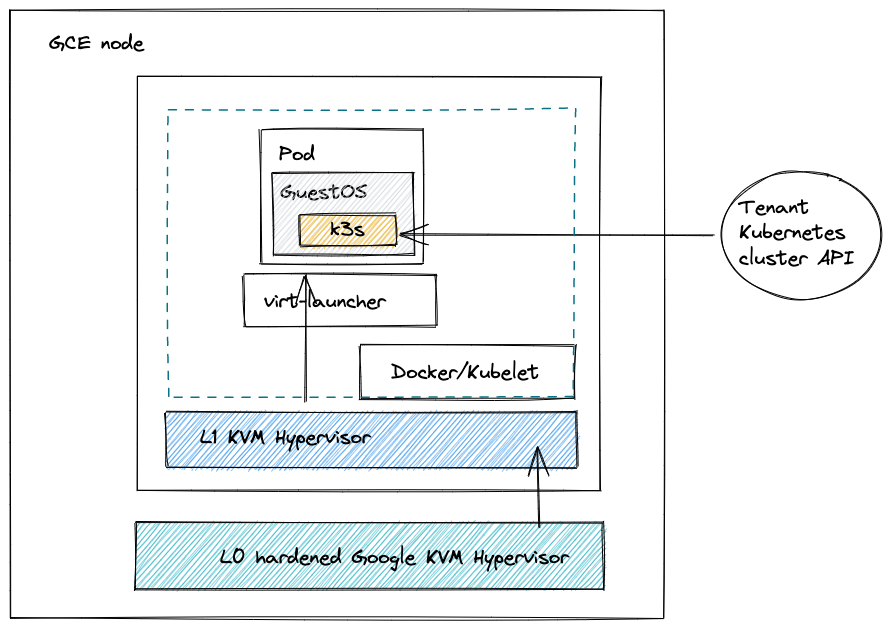

# multi-tenant-in-a-box

This project is designed to explore the nested virtualisation feature enabled within GCE Haswell based process families ( [see more](https://cloud.google.com/compute/docs/instances/nested-virtualization/overview)).



## GCE Creation

```
gcloud compute instances create multi-tenant \
  --enable-nested-virtualization \
  --zone=europe-west2-a \
  --min-cpu-platform="Intel Haswell"  --custom-cpu=4 --custom-memory=12 --create-disk=auto-delete=yes,boot=yes,device-name=multi-tenant,image=projects/ubuntu-os-cloud/global/images/ubuntu-1804-bionic-v20211206
```

## Installer 🚀

```
gcloud compute scp install.sh multi-tenant:~/install.sh`
gcloud compute ssh multi-tenant`

# Run the installer
./install.sh
```

## Post-install 🧨

```
sudo kubeadm init --pod-network-cidr=10.244.0.0/16
# ----------------------------------------------------
mkdir -p $HOME/.kube
sudo cp -i /etc/kubernetes/admin.conf $HOME/.kube/config
sudo chown $(id -u):$(id -g) $HOME/.kube/config
# ----------------------------------------------------
kubectl taint nodes multi-tenant node-role.kubernetes.io/master:NoSchedule-
kubectl apply -f https://raw.githubusercontent.com/coreos/flannel/master/Documentation/kube-flannel.yml
kubectl apply -f https://raw.githubusercontent.com/rancher/local-path-provisioner/master/deploy/local-path-storage.yaml
# ----------------------------------------------------
export VERSION=$(curl -s https://api.github.com/repos/kubevirt/kubevirt/releases | grep tag_name | grep -v -- '-rc' | sort -r | head -1 | awk -F': ' '{print $2}' | sed 's/,//' | xargs)
echo $VERSION
kubectl create -f https://github.com/kubevirt/kubevirt/releases/download/${VERSION}/kubevirt-operator.yaml

kubectl create -f https://github.com/kubevirt/kubevirt/releases/download/${VERSION}/kubevirt-cr.yaml
# ----------------------------------------------------
kubectl apply -f - << END > enable-feature-gate.yaml
---
apiVersion: kubevirt.io/v1
kind: KubeVirt
metadata:
  name: kubevirt
  namespace: kubevirt
spec:
  configuration:
    developerConfiguration: 
      featureGates:
        - HotplugVolumes
END
# ----------------------------------------------------
kubectl apply -f enable-feature-gate.yaml
```

#### HACK FOR QEMU-KVM ❌

```
sudo ln -s /usr/bin/kvm /usr/libexec/qemu-kvm
```

Then edit apparmor to add the following 
```
  /usr/lib/xen-*/bin/libxl-save-helper PUx,
  /usr/lib/xen-*/bin/pygrub PUx,
ADD THIS>>>  /usr/libexec/qemu-kvm PUx,
```

Restart apparmor `sudo systemctl restart apparmor`


### Validate virtualisation 💅🏻

```
alexjones@multi-tenant:~$ virt-host-validate qemu
  QEMU: Checking for hardware virtualization                                 : PASS
  QEMU: Checking if device /dev/kvm exists                                   : PASS
  QEMU: Checking if device /dev/kvm is accessible                            : PASS
  QEMU: Checking if device /dev/vhost-net exists                             : PASS
  QEMU: Checking if device /dev/net/tun exists                               : PASS
  QEMU: Checking for cgroup 'memory' controller support                      : PASS
  QEMU: Checking for cgroup 'memory' controller mount-point                  : PASS
  QEMU: Checking for cgroup 'cpu' controller support                         : PASS
  QEMU: Checking for cgroup 'cpu' controller mount-point                     : PASS
  QEMU: Checking for cgroup 'cpuacct' controller support                     : PASS
  QEMU: Checking for cgroup 'cpuacct' controller mount-point                 : PASS
  QEMU: Checking for cgroup 'cpuset' controller support                      : PASS
  QEMU: Checking for cgroup 'cpuset' controller mount-point                  : PASS
  QEMU: Checking for cgroup 'devices' controller support                     : PASS
  QEMU: Checking for cgroup 'devices' controller mount-point                 : PASS
  QEMU: Checking for cgroup 'blkio' controller support                       : PASS
  QEMU: Checking for cgroup 'blkio' controller mount-point                   : PASS
  QEMU: Checking for device assignment IOMMU support                         : WARN (No ACPI DMAR table found, IOMMU either disabled in BIOS or not supported by this hardware platform)
```

### Valdiate our host cluster control-plane

```
root@multi-tenant:/home/alexjones# v
NAMESPACE            NAME                                      READY   STATUS    RESTARTS   AGE
kube-system          coredns-64897985d-2sdnw                   1/1     Running   0          52s
kube-system          coredns-64897985d-5jrr7                   1/1     Running   0          52s
kube-system          etcd-multi-tenant                         1/1     Running   0          65s
kube-system          kube-apiserver-multi-tenant               1/1     Running   0          66s
kube-system          kube-controller-manager-multi-tenant      1/1     Running   0          65s
kube-system          kube-flannel-ds-lbbnh                     1/1     Running   0          28s
kube-system          kube-proxy-ztcx2                          1/1     Running   0          52s
kube-system          kube-scheduler-multi-tenant               1/1     Running   0          65s
local-path-storage   local-path-provisioner-5b94755fb4-d5fz8   1/1     Running   0          28s
```


### Now to install a tenant k3s VMI

```
gcloud compute scp tenant.yaml multi-tenant:~/tenant.yaml`
gcp compute ssh multi-tenant
kubectl apply -f tenant.yaml
```